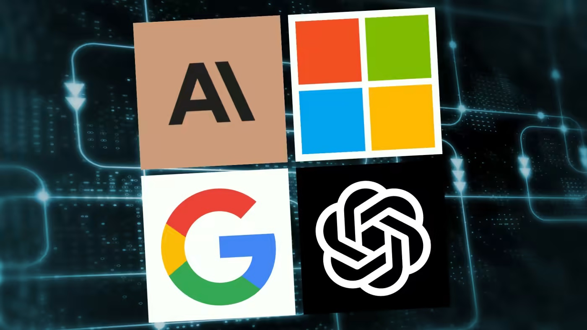

# Introduction

The landscape of education, particularly within Software Engineering (SE), is undergoing a fundamental shift. In my Software Engineering class, ICS 314, we transitioned from writing code to engineering systems. When that happened, Artificial Intelligence moved from a futuristic novelty to a daily collaborator. Throughout this course, I have integrated tools like Claude, GitHub Copilot, and Gemini into my workflow. However, rather than simply being a "cheat code", these tools served as a bridge between abstract architectural concepts and the granular syntax of frameworks like React, Bootstrap, and Nextjs.

 
 
# My experience with AI
 
1. Experience WODs e.g. E18

   -AI wasn't particularly useful for these WODs, as they were often slower paced and focused on learning. Most of the materials I needed were provided in the experience itself so I rarely used AI tools during Experience WODs.
   
2. In-class Practice WODs

   -AI tools were very helpful for in-class practice WODs, allowing me to prepare my environment faster and develop efficient solutions more quickly. It also provided me with accurate, specific, and quick documentation for reference. This came at the cost however, of less retention of syntax and common functions/implementations.
  
3. In-class WODs

   -AI tools were very helpful for in-class WODs, allowing me to prepare my environment faster and develop efficient solutions more quickly. It also provided me with accurate, specific, and quick documentation for reference. This came at the cost however, of less retention of syntax and common functions/implementations.
   
4. Essays

   -AI was particularly useful for the technical essays. It helped me structure my ideas and organize them into paragraph form, something that is admittedly not my strong suit as a CS major. This probably should have been more of an exercise of my writing ability, but I feel that AI tools helped me convey my ideas more eloquently. I obviously still directed the main content of the essays and rewrote them in my own words to maintain authenticity.

5. Final project

   -AI tools were very useful for the final project, as it dealt with a significant amount of code covering many complex topics. Most often, I would use AI for tips on implementing new components or solving confusing errors.
   
6. Learning a concept / tutorial

   -I rarely used AI to help me learn a concept/generate a tutorial. I found it worse at this task, often explaining at too high or low a level and leaving out important information. Popular educational websites like StackExchange or W3Schools were my go-to when learning new concepts.
   
7. Answering a question in class or in Discord

   -I didn't use AI for this case. Most questions asked in class or in Discord were more focused on our knowledge or experience, as opposed to specific software engineering questions, which could have been asked directly to AI.
   
8. Asking or answering a smart-question

   -I often used AI to help answer my smart-questions, as it understands natural language and often was able to help me solve my problem very quickly.
   
9. Coding example e.g. “give an example of using Underscore .pluck”
    
   -AI was very useful for generating coding examples, making solving problems and completing assignments easy and efficient.
   
10. Explaining code
    
   -This is one of the things AI tools excel at, which I used frequently in class, during WODS, and during assignments.
    
11. Writing code
    
   -I rarely used AI for this purpose. Not only is it disingenuous, but it rarely accomplished the task properly the first time. AI tools have a tendency to misunderstand complex instructions, and using AI to write code often left me with more work cleaning up and fixing than had I just written it myself.
   
12. Documenting code
    
   -This is another thing that AI tools excel at, helping me quickly and accurately develop some basic documentation for my programs.
    
13. Quality assurance e.g. “What’s wrong with this code [code here]” or “Fix the ESLint errors in [code here]”

   -This was the situation where I used AI tools most often. VSCode has a button that copies information about errors, allowing me to paste them into AI tools. They would then explain the issue in natural language and often offer several solutions. This was extremely useful and helped me solve issues and complete programs much quicker.
    
14. Other uses in ICS 314 not listed
    
   -Another situation I used AI for in ICS 314 was UI development. When redesigning a website with HTML and CSS, sometimes I would ask AI how to format my code such that it matched my desired final product.

# Impact on Learning and Understanding

The incorporation of AI into ICS 314 aided in my learning and development of software. It has significantly enhanced my comprehension by providing instant, varied explanations for difficult concepts like functional programming and asynchronous logic. However, this convenience brings the challenge of "knowledge debt." If I use an AI suggestion without fully deconstructing why it works, I risk developing a shallow understanding of the material. It has challenged my problem-solving abilities by shifting my role from a "writer" to a "reviewer," forcing me to verify the accuracy and best practices of the AI's output, which is a critical skill in modern software engineering.

# Practical Applications

Outside of ICS 314, AI has many important real-world applications. For example, it has been making massive strides in the biology and medical fields, helping scientists understand protein functions just from its sequence/shape. More specifically in the field of Software Engineering, AI is proving to be very useful and will likely be the future of the field. It is currently very effective at addressing real-world software engineering challanges, and I've used it personally in my personal hobby projects listed on the projects page of this website.

# Challenges and Opportunities

One challenge I encountered was version confusion, where AI models would suggest code using older or newer versions of React or Nextjs that were not compatible with our course requirements. Additionally, the temptation to "tab-complete" my way through a difficult logic puzzle remains a constant hurdle for skill retention. Despite these limitations, there are massive opportunities for further integration. Software engineering education could incorporate AI-driven "hint systems" in GitHub that provide feedback on code quality and security vulnerabilities in real-time, effectively giving every student a 24/7 teaching assistant.

# Comparative Analysis

Comparing traditional teaching methods to an AI-enhanced approach reveals a clear trade-off between foundational depth and professional speed/familiarity. Traditional methods, such as manual debugging and documentation reading, foster high knowledge retention but can lead to high frustration and slower project progress. The AI-enhanced approach significantly increases engagement by providing immediate success and allowing students to build more complex projects faster. While there is a risk that AI might hinder the development of raw logic skills, it better mimics the current state of the industry, where efficiency and the ability to leverage tools are as important as knowing how to write a for-loop from scratch.

# Future Considerations

In the future, I believe AI will continue to fundamentally change software engineering education. We will likely see a shift away from grading syntax and toward grading architectural thinking and system design. As AI continues to get better at writing the actual lines of code, students will need to be taught how to orchestrate these models, manage security at scale, and handle the ethical implications of automated systems. The challenge for educators will be finding the balance between ensuring students understand the "magic" happening under the hood while preparing them for a professional world that expects them to use every tool at their disposal.

# Conclusion

My experiences using AI in ICS 314 have highlighted it as a powerful, yet double-edged, collaborator. It served as a vital tool for the learning process, helping me bypass syntax roadblocks to focus on high-level software engineering principles. To optimize this integration in future courses, I recommend that curriculums explicitly incorporate AI literacy and prompt engineering. By treating AI as a tool to be mastered rather than a shortcut to be avoided, we can better prepare students for the realities of the modern software engineering workforce while maintaining a high standard of personal understanding.
