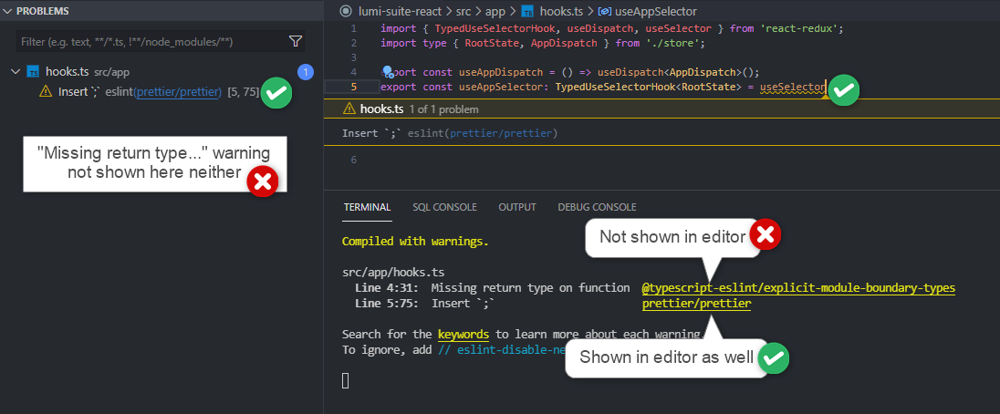

# Why have a Standard?

There are a lot of ways to write code. There are a lot of people that write code. This creates quite a few issues, specifically with some programs being more difficult to understand and be worked on by the author and other programmers. Coding standards have come about as a solution to this problem. These are the convention of formatting that most professional programmers try to follow. For example, it is common to use comments to explain your code, and to initialize a variable for numbers you use repeatedly within the project. These conventions make it much easier for the author of a program to remember how their code works and why it was written like it was, and this also applies to anyone else reading the code, for example another developer on the same project. Coding standards can also make programs less error-prone, as the conventions are usually designed to make programming efficient and careful.

# Potential Issues
 
Although they generally benefit all programmers, Coding standards can have some problems. The first is that there are many different languages, and each language is usually updated with multiple versions as time goes on. This can cause confusion, for example some languages require strings to be initialized with double quotes and others don't distinguish between single and double quotes. This causes many coding standards to be arbitrary and unique to the langauge to which they apply, somewhat defeating the purpose of there being a standard. The other, primary problem with Programming standards is that they are highly subjective. People obviously differ in their opinions as to what makes code "prettier" and easier to read. Because these are simply standards and conventions, there is nothing requiring Software Engineers to follow them, once again defeating the purpose of coding standards.

# My Experience/Resolution

I personally appreciate many programming standards, but firmly support an individual's right to follow or reject them as necessary. For example, my ICS 314 class, Software Engineering, requires that we download and obey the format checking program ESLint. This software reports many common programming conventions as errors, helping to ensure that our Typescript code is written to standard. I find very strong issue with this, for example it requires that strings are initialized with only single quotes. As someone who has spent the majority of their programming career working with C++ and Java, I find it very difficult to remember to use single quotes in a situation where double quotes, what I'm used to, works just fine. While following a convention is impmortant for readability and maintenance, I believe that an individual programmer should be able to decide the style that they feel makes the most sense and works best for them. So long as code is well written and follows a common standard, that standard should not be nitpicked.
