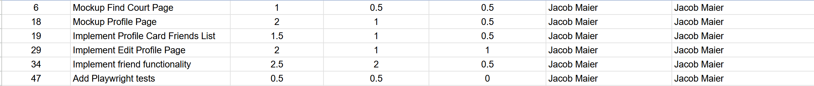

# Making the estimates

Primarily, my method for estimating effort was driven by "gut feel" and knowledge of my past performance on assignments. I’ve noticed that UI design is consistently my biggest time-sink, especially when building from scratch without a template. While the brainstorming phase felt long, front-loading the design thinking ultimately streamlined my implementation.

# Benefits of estimating in advance
 
Even though my estimates were frequently optimistic, the act of forecasting was invaluable. It forced me to map out my schedule and identify critical dependencies early. For instance, I realized I couldn’t polish the profile page until my teammates had refined our Court display card. Estimating helped me prioritize the individual components before diving into the overall page design.

# Importance of actual effort tracking

I would describe my experience with tracking as somewhat useful. While it didn't significantly impact the actual hours required for the project, it  improved my pattern recognition. I am now much more realistic about the time requirements for future tasks.

# Reflection

To monitor my progress, I relied on a mix of mental logging and analyzing the time gaps between Git commits. While this wasn't perfectly consistent due to interruptions, it kept time management at the forefront of my mind. Moving forward, I want to transition from intuition-based guessing to a data-driven approach with the VSCode extension WakaTime to get a clearer picture of my accuracy.

# Use of AI

I integrated Gemini, Claude, and Copilot to accelerate my workflow—specifically for conceptual explanations, debugging, and further developing components. My process typically involved 10 minutes of prompt engineering followed by 20–30 minutes of debugging and integration. AI acted as a catalyst for speed, but I never treated it as a "set and forget" tool; every line of generated code underwent a manual screening to ensure it aligned with my vision.
