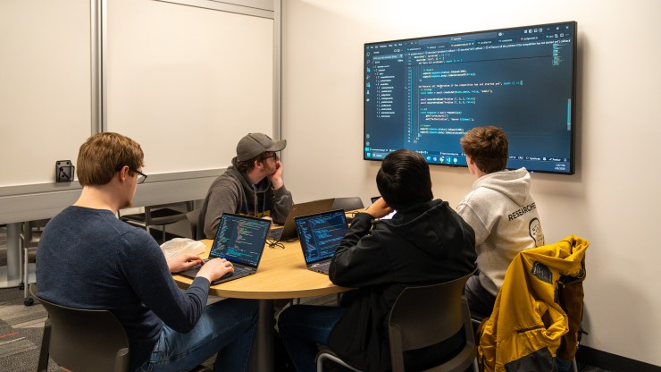

# Beyond Web development

As this course draws to a close, it is tempting to look at the portfolio of web applications we’ve built and conclude that we are now "web developers." While true, that label is a bit like calling an architect a "brick-layer." The languages and frameworks we used—the "bricks"—are secondary to the engineering principles that held our projects together. Software engineering is not merely the act of writing code; it is the disciplined application of processes and patterns to manage complexity and ensure reliability. To illustrate this, let’s look at three core pillars of this class: Agile Project Management, Design Patterns, and Configuration Management, and how they function far beyond the confines of a web browser.

# Agile Project Management

At its core, Agile Project Management is an iterative approach to software development that prioritizes flexibility, collaboration, and frequent delivery of small, functional pieces of a project. Instead of a waterfall method, where you spend months planning every detail only to find the world has changed by the time you launch, Agile assumes change is inevitable. In this class, we specifically practiced Issue Driven Project Management (IDPM). In this style, every task, bug, or feature is documented as a discrete "Issue." These issues are tracked on a board, assigned to team members, and moved through states like "In Progress" or "To-do."

Beyond web development, I could easily see IDPM being the backbone of a robotics engineering project. Imagine building an autonomous drone. The "web stack" is non-existent here, but the complexity is massive. By using IDPM, the team could break the project into specific issues: "Calibrate altimeter sensor," "Implement obstacle avoidance algorithm," or "Stress test battery life in sub-zero temps." This provides total transparency; anyone on the team can see exactly what is blocking the drone’s first flight without needing a three-hour meeting.

# Design Patterns

When engineers face a recurring problem, they don't reinvent the wheel; they use a Design Pattern. A design pattern is a generalized, reusable solution to a commonly occurring problem within a given context in software design. Think of them as blueprints for how objects and classes should interact. One common pattern I used was the Observer Pattern. This is a design where an object (the subject) maintains a list of its dependents (observers) and notifies them automatically of any state changes.

Design patterns are the lifeblood of many embedded systems beyond web development, such as the software running inside your car’s dashboard. When you press the brake pedal, multiple systems need to know: the brake lights need to turn on, the anti-lock braking system (ABS) needs to engage, and the regenerative braking in an EV needs to start harvesting energy. By using the Observer Pattern, the "Brake Pedal" code doesn't need to know anything about lights or batteries; it simply "notifies" its observers that it has been pressed. This decoupling makes the car’s software safer and easier to update.

# Configuration Management

Perhaps the most important discipline we learned is Configuration Management (CM). This is the process of tracking and controlling changes in the software. It involves version control (like Git), environment consistency, and build automation. It ensures that "it works on my machine" is a phrase that never has to be uttered, because every change is documented, reversible, and reproducible.

Beyond web development, Configuration Management is absolutely critical in Scientific Computing and Research. Imagine a team of physicists running simulations on a supercomputer to model climate change. If they discover a breakthrough six months into the project, they must be able to prove exactly which version of the code produced those results. Without CM, their findings would be scientifically invalid. By using strict configuration management, they can "roll back" the entire system state to any point in time to verify their data, ensuring that their contribution to science is built on a foundation of integrity rather than lucky guesswork.

# Key Takeaways

The "web" part of this class was the laboratory, but the "software engineering" part was the science. Whether I eventually find myself building cloud-based computing platforms, flight control systems for aerospace, or the next generation of medical imaging software, I won't just be bringing a tech stack with me. I’ll be bringing a mindset that values organized transparency (Agile), structural efficiency (Design Patterns), and rigorous accountability (Configuration Management). That is the true transition from a student who codes to a software engineer.
