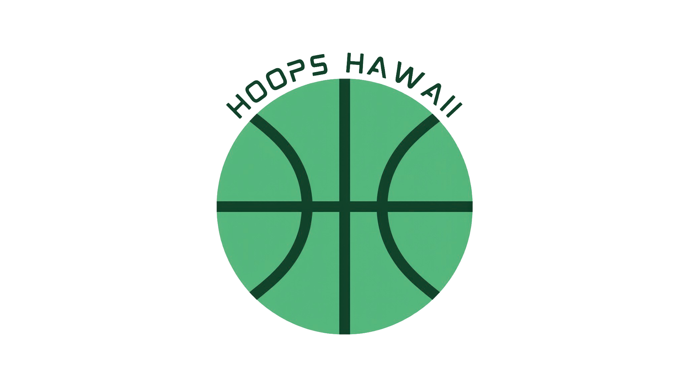

# Introduction

This essay will be completed by the due date on Lamaku, May 14th.

# Experience
 
This essay will be completed by the due date on Lamaku, May 14th.

# Key Takeaways

This essay will be completed by the due date on Lamaku, May 14th.
