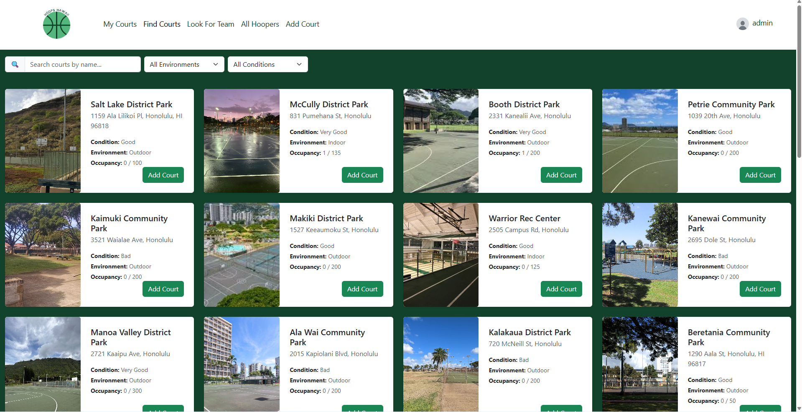

# Description

Hoops Hawaii is a community focused web application designed to help players find courts and pick-up games across the islands. Working as part of a software development team, I helped design the UI and database functionality. We worked together to build an accessible user experience and a database schema to manage court data and real-time user check-ins. This team-based approach ensured that we learned a lot about all aspects of Web Design and Software Engineering, and we each were able to contribute to the final form of the project.

# Takeaways

This project provided invaluable insight into the collaborative nature of software engineering. I learned that a sleek UI is only as good as the database supporting it, and keeping those two in sync requires constant, clear communication among teammates. Navigating shared repositories and coordinating our schema updates taught me how to write cleaner code and manage the complexities of version control in a group setting. Ultimately, Hoops Hawaii taught me how to translate community needs into technical requirements, proving that the best software isn't just built with code—it’s built through effective teamwork and a shared vision.

#Links

Project: <Link src="https://hoops-hawaii-nextjs.vercel.app/">https://hoops-hawaii-nextjs.vercel.app/</Link>

Source Code: <Link src="https://github.com/hoops-hawaii">https://github.com/hoops-hawaii</Link>
