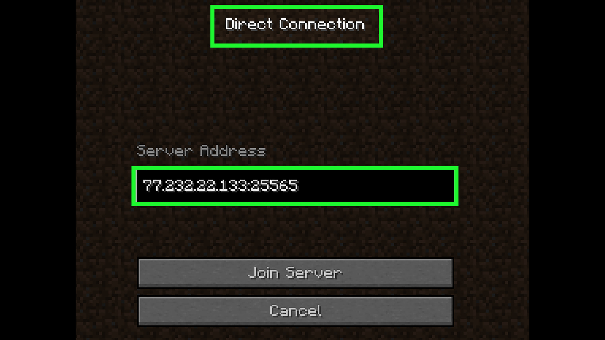

# Server

I set up a Minecraft server on my Raspberry Pi by installing Java, downloading the server files, and configuring the server properties. Because of the Pi's limited hardware, the server required quite a bit of fine tuning and research of mods to make the server run smoothly. To allow friends outside my local network to join the server, I set up port forwarding on my router. By forwarding Minecraft’s default port (25565) to the Raspberry Pi’s local IP address, I enabled incoming connections from the internet to reach the server securely. This configuration made the server accessible remotely while still running on my home network. This was my first introduction into the interesting world of networking and network security, experience in which can be very useful later in my career.

# Remote Access

To manage the server remotely, I accessed the Raspberry Pi using SSH. This let me start and stop the server, edit configuration files, and monitor performance directly from my main computer without needing a keyboard or monitor connected to the Pi. This is another networking technology that is very common with controlling databases and servers, so having experience with it can be very useful. It also helped me gain experience using Windows' terminal.
