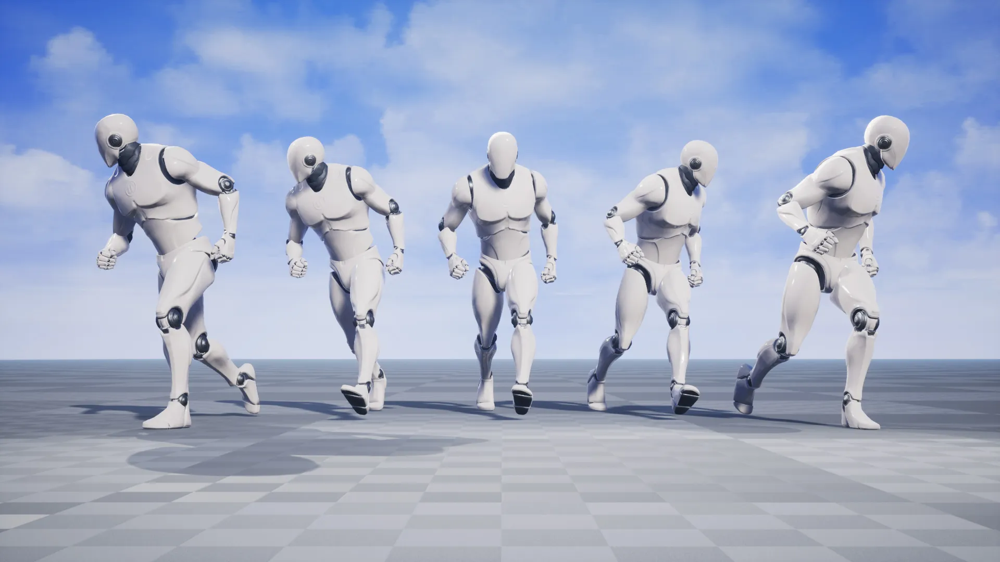

# Explanation

This project was mostly a proof-of-concept that I worked on for fun over the summer to help myself become introduced to Unreal Engine. In most video games, moving your character forward activates an animation, causing the character to mimic human-like movement as their model is moved through space. This has issues, however, as uneven surfaces can cause the character models' feet to appear to be suspended midair or poking through the ground. One way to fix this, that I explored, is a system called procedural walking animation. This, as opposed to traditional animation, uses an algorithm to procedurally predict the motion of the character model, and how its feet should interpolate from its starting position to its next step.

# Implementation

I made my program entirely within Blueprints, Unreal Engine's bespoke visual scripting language. Unreal Engine also supports C++, but I hadn't learned it when I worked on this project. The system first moves the torso according to the player's inputs, and then predicts the model's future position based on its current speed and direction. It then smoothly interpolates the feet from their current position to that target, raising and then lowering them as it does so. It also located the ground in relation to the model's feet, accurately positioning them so that they appear to be flat on the ground no matter the angle or height. A resource that significantly helped me handle this project was [this youtube guide](https://youtu.be/Z8eqaFG7lZQ?si=9miz0evKQnqRp9IO) by Unreal Engine about producing procedural animation.
